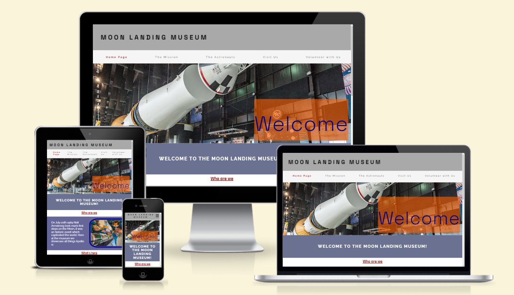
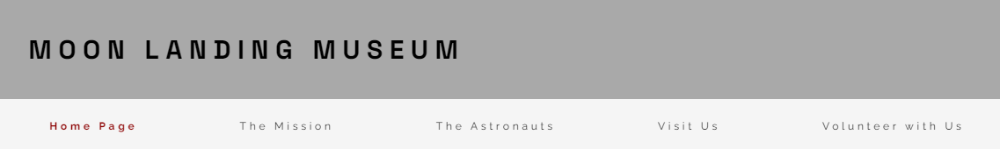
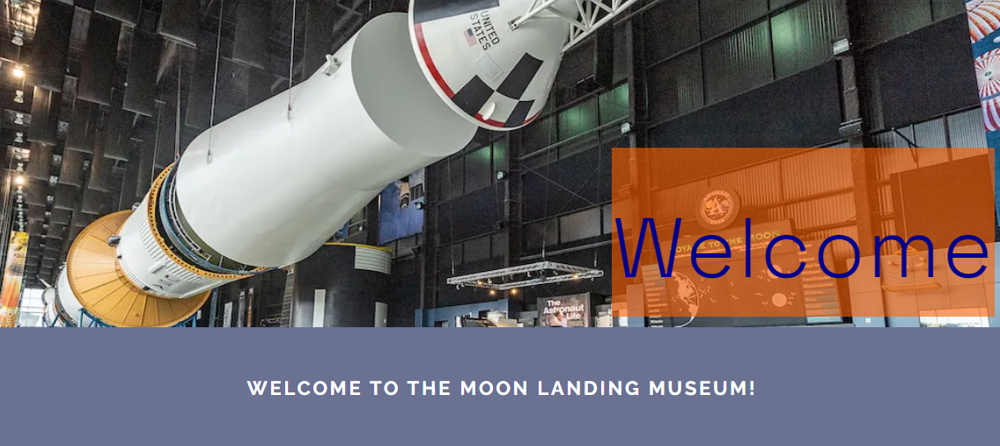
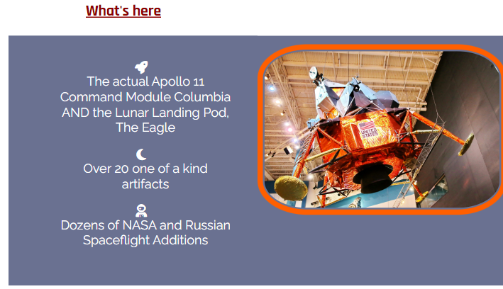
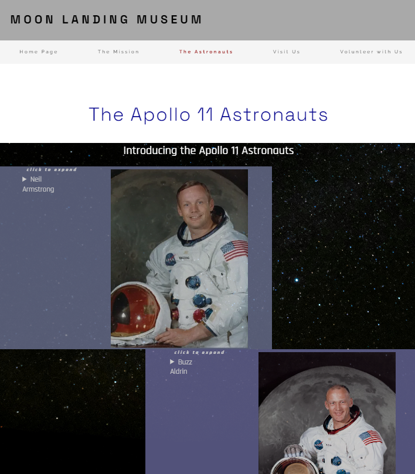
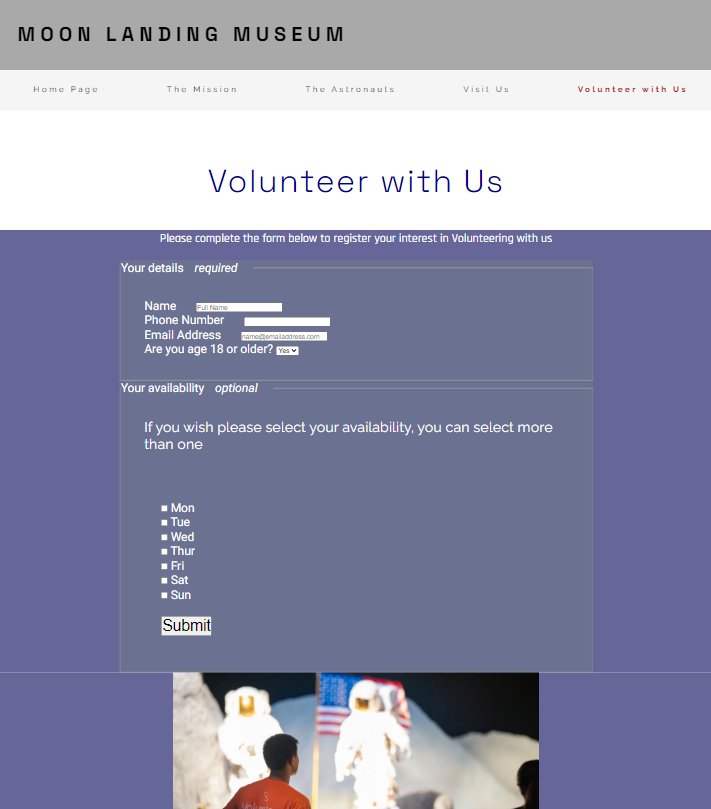

# Moon Landing Museum

## Intro
The Moon Landing Museum website is for Space exploration enthusiasts, particularly those interested in the mission that first put Man on the Moon, the Apollo 11 Mission.
The Museum is a one-stop shop for all things Apollo 11. 

Users of the website will not only be able to find out what the Museum showcases, information on how to visit and methods of contact, but also learn about the history of Apollo, a timeline of the mission and the Apollo 11 astronauts. Users can also register their interest to volunteer at the Museum. The site is targeted at an audience of space lovers, particularly those interest in the Apollo 11 Mission. 

## User Experience Stories

 - As a user I want to understand what events lead up to the Apollo 11 Mission, who initiated it and how the Apollo program was developed.
 - As a user I want to learn about the astronauts who were part of the Apollo 11 Mission, how they became astonauts and what their role was on the mission.
 - As a user I want to find out what the Museum showcases and how I can visit it. 

## Design
 - __Color Scheme__
  - The Header and Footer are light grey with black font, the black intending to stand out and catch the user's attention.
  - The Nav Main Menu is also black font on a white smoke background.
  - There are two main colors used throughout this site, they are dark blue-grey and blue kimberly.
  - The supporting colors, which are primarily used for Headers are dark blue, dark red and dark orange.
  - The primary font color is white.
  

 - __Typography__
  - The fonts Space Grotesk and Rajdhani are used for the Headers and Menus within this project, they stand out so that they catch the user's attention, and also fit with the space and Sci-fi theme.
  - The fonts Raleway and Roboto are used for the main content of the site, they are a softer font and easier to read for the user.
  - The font sans-serif is set as the fallback for all fonts in the instance that the browser does not import the fonts correctly.

## Features 
### Existing Features

- __Header and Navigation Bar__

  - The Header and Navigation Bar encompases the Logo and Menu. Its featured at the top of the page with the Logo located to the left. The Menu is either located beneath the Header across the whole width of the page when the screen is large enough, or on smaller screens as a burger icon to the top right of the page, which expands vertically when checked.
  - The Header has a light grey background with a black, uppercase font, which is clear and stands out to the user.
  - The Menu consists of 5 pages; Home Page, The Mission, The Astronauts, Visit Us and Volunteer with Us. In contrast to the Header the background is white and the font is smaller with only the first letter of each word capitalized. This is so the Header and the Menu are clearly defined to the user. The current page is highlighted to the user in dark red font.
  - The Header and Menu are identical across all pages to keep consistency and ensure its easy to navigate for the user. Its fully responsive depending on the screen size its viewed on.

  

  

  

- __The Landing Page - Welcome Page__

 - The Landing page cosists of a number of sections;
   - A Welcome Image and Message, Who are we, Whats here and Our Website.
   - It showcases the sites two main chosen colors; dark blue-grey and blue kimberly, which carry through to all other pages to ensure fluidity, and the site's other supporting colors; dark blue, dark red and dark orange.

  - Welcome Image and Message:
    - The Welcome Image is located directly below the Header and Navigation Menu. It shows the Saturn 5 Rocket displayed in the Museum which introduces the user with what to expect from the Museum.
    - There is a 'Welcome' Text Overlay which is bright and eye catching, intended to grab their attention.
    - Underneath the Welcome Image is a message welcoming the user to the website. To again grab the user's attention the text is in Uppercase format and in contrast to the darker background. 

    

  - Who are we section:
    - The Who are we section outlines the purpose of the Museum to the user, they will get a detailed insite into the Apollo 11 Mission.
    - There is a supporting image depicting two people viewing the Saturn 5 Rocket in the museum outlined in one of the site's supporting colors: dark blue.
    - There is a red subtitle to this section so the user knows what the purpose of the section is. 

    

  - What's here section:
    - This section lists what the user will find at the Museum, the Apollo 11 Command Module and Lunar Landing Pod, along with artifacts and other NASA and Russian Spaceflight additions.
    - There is a supporting image of the Lunar Landing Module, outlined in one of the chosen supporting colors: dark orange.
    - Again there is a red subtitle to this section.

    

  - Our Website section:
    - This sections explains to the user what the Website consists of, indicating this with another red subtitle. 
    - The user is told they can learn about the timeline of the mission itself along with the events that lead up to it.
    - The user is also informed that there is information on the Apollo 11 astronauts.
    - The section also lets them know they can find out how to visit the museum and that there is a form they can complete to register their interest to volunteer with them.
    - There are additional links within this section to the Mission Page, Astronauts Page, Visit Us Page and Volunteering Page. 

    

- __The Mission Page__

  - The aim of this page is to clearly outline to the user how the Apollo 11 Mission came about as well as key moments of the Mission.
  - The Title of the page is centered at the top in a clear font with red subtitles seperating the sections into the History and the Timeline.
  - The two main colors are used as the background in an alternating pattern to clearly outline each event to the user.
  - When the page is in smaller screen format the events are layered vertically, as the screen size increases, the boxes move to organise horizontally.
   
   

- __The Astronauts Page__

  - There are three sections to this page, each section is dedicated to each of the Apollo 11 astronauts.
  - Each section consists of the astronaut's name with a expanding section which gives a short biography of each astronaut, followed by an image of them.
  - This section aims to provide the user with the following information on each of the three Apollo 11 astronauts; how they came to be part of NASA, other spaceflight missions they have been part of and what they went on to do after the Apollo 11 Mission. 

  
  

- __Visit Us Page__

  - The Visit Us Page gives important information to the user should they wish to visit the Museum.
  - It provides them with the opening times and where it's located. There is a supporting embeded google maps providing a visual location of the Museum.
  - The page also provides the contact information for the Museum to encourage them to get in touch.

  

- __Volunteer Sign Up Form__

  - This Page contains a form requesting the following details;
    - Full Name
    - Phone Number
    - Email Address
    - Confirmation of Age 18 or over
    - Options for availability
  - The form allows the user to register their interest to volunteer at the Museum. Some of the fields (Full Name, Phone Number, and Email Address) are mandatory and will not allow the user to submit unless completed.
  - Once the form is submitted they are taken to a landing page thanking the user and informing them that someone will be in touch soon, confirming to the user that the form has been completed successfully. The landing page will still consist of the Header and Footer, so the user can navigate back to any of the other pages or take a look a the Museum's social media platforms.

  
  

- __The Footer__ 

  - The Footer consists of the Museum's social media pages; Facebook, Instagram and Twitter (X).
  - When selected the pages will open on a new tab so that the user can easily navigate back to the Museum's website.

  

### Features Left to Implement

  - Gallary of images and Videos of the Apollo 11 Mission.
  - Pages details other Apollo Missions both prior and following the Apollo 11 Mission.
  - Information on NASA's next exploration to the Moon, the Artemis Project.
  - Information on Events happening at the Museum.
  - A Dark Mode Toggle Feature.

## Testing 

 - I have tested this site in the following browsers to confirm it works across different browser: Safari, Chrome, Firefox, Microsoft Edge.

 - By using Chrome DevTools I can confirm that this site is responsive across the standard screen sizes; 
   - Mobile < = 768px
   - Tablet > = 768px
   - Laptop > = 992px
   - Desktop > = 1200px
  
  - I confirm that all Headers and text are clear to read for the user. That the Header and Navigation Menu are clearly defined and easy to navigate. That sections on each of the pages; Home Page, The Mission, The Astronauts, Visit Us and Volunteer with Us, are defined clearly to the user and that the content is easy to understand.

  - I have tested that the form works. The form will only complete and navigate the user to the confirmation page if the Name, Phone Number, and Email Address are completed. I have tested the Submit button and it successfully takes you to the confirmation landing page.

### Validator Testing 

- __HTML__
  - No errors were returned when passing each page through the official W3C validator.

- __CSS__
  - No errors were found when passing through the official (Jigsaw) validator.

- __Accessibility__
  - I confirmed that the colors and fonts chosen for each page are easy to read and accessible by running it through lighthouse in Chrome DevTools.

  

  

  

  

  

  

### Bugs

- __Fixed Bugs__

 - Hero Element not loading:
    - When first deploying the site through GitHub pages the background image for the Hero Element did not load and the site was broken.
    - I found that this was due to using an absolute file path to the background image in my CSS code.
    - I fixed the issue through changing the file path to a relative file path. The Hero image loaded and the site was fixed.

 - No landing page after submitting volunteer form:
    - After creating the form and testing in both the preview and live environment I was presented with an error landing page when pressing submit. 
    - I found that I had entered the wrong value for method, having originally entered 'post'.
    - After changing this to 'get' the correct confirmation landing page was achieved after the submit button was selected.

 - Header overlapping h2 elements:
   - I found that the header was overlapping part of the h2 elements on each page.
   - I discovered that this was due to some of the additional media queries I had added to my code to enlarge font on larger screens .
   - I fixed this by adding a margin-top property to h2 elements with a value of 8%.

 - Link to Volunteering page not working
   - Link to Volunteering page not working in the third section of Index.html.
   - Found this was due to anchor elements not wrapping the words Volunteering Page.
   - Moved the closing a element so that Volunteering Page wrapped within the two elements and the link as successfully applied.

- __Unfixed Bugs__
  - No unfixed bugs

## Deployment

- The site was deployed to GitHub pages. The steps to deploy are as follows: 
  - In the GitHub repository, navigate to the Settings tab 
  - From the source section drop-down menu, select the Master Branch
  - Once the master branch has been selected, the page will be automatically refreshed with a detailed ribbon display to indicate the successful deployment. 

The live link can be found here -  https://cgalpin92.github.io/project-portfolio1-moonlandingmuseum/

## Credits 

### Content 
 - The information for the various text on each page were sourced from Wikipedia and the National Air and Space Museum Smithsonian:
   - https://en.wikipedia.org/wiki/Neil_Armstrong
   - https://en.wikipedia.org/wiki/Buzz_Aldrin
   - https://en.wikipedia.org/wiki/Michael_Collins_(astronaut)
   - https://airandspace.si.edu/explore/stories/apollo-missions/apollo-11-moon-landing/apollo-11-timeline

 - The contact details referenced on the Visit Us page were sourced from The National Space Center:
   - https://www.spacecentre.co.uk/

 - Code sourced from the Love Running Project:
   - Code for creating the header with nav menu styled as burger icon
   - Code for expanding the Nav main menu when toggled
   - Code for creating the social-media links in the Footer
   - Code for creating the Hero Image

 - Code sourced or guidance taken from w3 schools:
   - Hero Image styling and positioning - https://www.w3schools.com/howto/howto_css_hero_image.asp
   - Flex-wrap styling guidance - https://www.w3schools.com/cssref/css3_pr_flex-wrap.php
   - Responsive flex-box guidance - https://www.w3schools.com/css/css3_flexbox_container.asp
   - Guidance on responsive side-by-side images and text - https://www.w3schools.com/howto/howto_css_images_side_by_side.asp
   
 - Guidance for positioning and styling the background in Astronauts.html taken from Code Institute's Coder's Coffee House
 - Guidance for border styling on the index.html images and mission.html paragraphs taken from Wordpress - https://wordpressua.uark.edu/sites/how-to-add-a-border-around-an-image/ 
 - Guidance for styling the details element taken from Sitepoint - https://www.sitepoint.com/style-html-details-element/

### Media
 - Hero Image and Who Are We image taken from the Smithsonian Magazine - https://www.smithsonianmag.com/travel/cross-country-guide-celebrating-50th-anniversary-moon-landing-180972204/
 - Icons taken from Font-Awesome - https://fontawesome.com/icons
 - Stars background image on Astronauts.html sourced from Pexels - https://www.pexels.com/search/stars/
 - Neil Armstrong profile picture sourced from https://tvtropes.org/pmwiki/pmwiki.php/UsefulNotes/NeilArmstrong
 - Buzz Aldrin and Michael Collins profile picured sourced from Wikipedia
 - Volunteer image sourced from Space Center Houston - https://spacecenter.org/support/volunteer/

